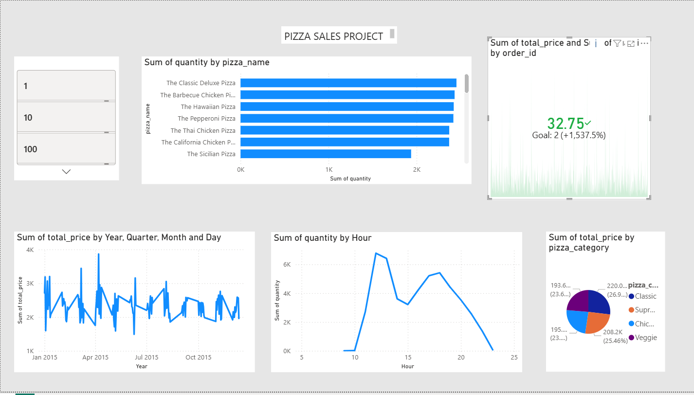

# 🍕 Pizza Sales Interactive Dashboard

## 📌 Overview

This project is an **end-to-end data analysis and interactive dashboard** built using Python and Streamlit. It transforms raw pizza sales data into meaningful business insights through visualizations and filters.

The dashboard allows users to explore sales trends, customer behavior, and product performance dynamically.

---

## 🚀 Features

* 📊 **KPI Metrics**

  * Total Revenue
  * Total Orders
  * Total Quantity Sold

* 🔝 **Top 10 Best-Selling Pizzas**

* 📅 **Daily Sales Trends**

* ⏰ **Peak Ordering Hours**

* 🍕 **Category Distribution**

* 📏 **Size-wise Revenue Analysis**

* 🎛️ **Interactive Filters**

  * Filter by Pizza Category
  * Filter by Pizza Size

---

## 📁 Project Structure

```text
pizza-sales-analysis-main/
│
├── app.py                # Streamlit dashboard
├── analysis.py           # Python analysis script
├── data/
│   └── pizza_sales.csv   # Dataset
├── dashboard.png         # Dashboard preview
├── sql_queries.sql       # SQL analysis (optional)
├── README.md
```

---

## ⚙️ Technologies Used

* Python (Pandas)
* Streamlit
* Plotly
* CSV Dataset

---

## 📊 Dashboard Preview



---

## ▶️ How to Run

### 🔹 1. Clone Repository

```bash
git clone https://github.com/PRIMODIALNYXAlpha/Pizza-Sales-Analysis-Dashboard.git
cd pizza-sales-analysis-main
```

---

### 🔹 2. Install Dependencies

```bash
pip install pandas streamlit plotly
```

---

### 🔹 3. Run the App

```bash
python -m streamlit run app.py
```

---

## 💡 Key Insights

* Peak sales occur during **lunch and evening hours**
* Certain pizzas consistently generate higher revenue
* Category and size analysis helps in inventory planning
* Sales trends vary across different days

---

## 🎯 Use Cases

* Business decision-making
* Sales trend analysis
* Customer demand forecasting
* Inventory optimization

---

## 👨‍💻 Author

**Tarun SR**

---

## ⭐ Conclusion

This project demonstrates the ability to build a **real-time interactive data dashboard**, combining data analysis with modern web visualization tools.

⭐ If you found this useful, consider starring the repository!
